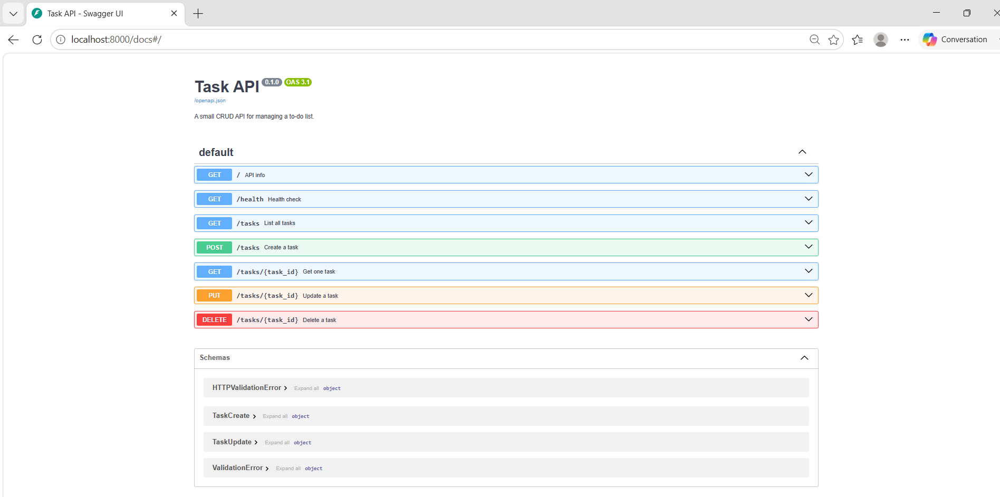
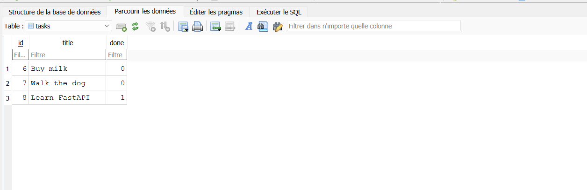

# Task API — CRUD API (FastAPI)

A small in-memory CRUD API for managing a to-do list. Built with **Python** and **FastAPI** as part of the FlyRank Internship — Backend Track, Week 2.

Data is stored only in memory (a Python list) — it resets every time the server restarts. This is intentional for this stage; a database comes in Week 3.

## How to run it

1. Clone this repo and open a terminal in the project folder
2. Create and activate a virtual environment:
```bash
   python -m venv venv
   venv\Scripts\activate
```
3. Install dependencies:
```bash
   pip install fastapi uvicorn
```
4. Run the server:
```bash
   uvicorn main:app --reload --port 8000
```
5. Open your browser to `http://localhost:8000/`

## Endpoints

| Method | Path | Description | Success | Errors |
|--------|------|--------------|---------|--------|
| GET | `/` | API info | 200 | — |
| GET | `/health` | Health check | 200 | — |
| GET | `/tasks` | List all tasks | 200 | — |
| GET | `/tasks/{id}` | Get one task | 200 | 404 |
| POST | `/tasks` | Create a task | 201 | 400 (missing/empty title) |
| PUT | `/tasks/{id}` | Update a task | 200 | 400, 404 |
| DELETE | `/tasks/{id}` | Delete a task | 204 | 404 |

## Example (curl -i)

```
C:\Users\DELL\Desktop\todo-api>curl -i http://localhost:8000/tasks/1
HTTP/1.1 200 OK
date: Tue, 21 Jul 2026 09:20:59 GMT
server: uvicorn
content-length: 40
content-type: application/json

{"id":1,"title":"Buy milk","done":false}

```

```
C:\Users\DELL\Desktop\todo-api>curl -i http://localhost:8000/tasks/99
HTTP/1.1 404 Not Found
date: Tue, 21 Jul 2026 09:21:50 GMT
server: uvicorn
content-length: 29
content-type: application/json

{"error":"Task 99 not found"}

```

## Swagger UI

Interactive API docs are available at `http://localhost:8000/docs`, auto-generated by FastAPI. The full CRUD cycle (create, read, update, delete) was tested there via "Try it out."



## Database (SQLite)

This project now stores tasks in a real SQLite database instead of an in-memory list, as part of Week 3 of the internship.

**Why SQLite?** It requires no separate server or installation — the entire database is a single file. That makes it perfect for a small project like this: zero setup, and the data survives every server restart.

**Where the database lives:** `tasks.db`, created automatically the first time the server starts. It's excluded from Git (`.gitignore`) so every fresh clone starts with a clean database — the app creates the table and seeds 3 example tasks automatically on first run.

### Example SQL query

Run directly in DB Browser for SQLite, on the "Execute SQL" tab:

```sql
SELECT COUNT(*) FROM tasks;
```

This returned `4` — the total number of tasks stored at that moment, counted directly by the database instead of in Python code.

### Database viewer screenshot



## Notes

- All data is in-memory only — restarting the server resets the task list back to the 3 seed tasks.
- Error responses use a consistent `{"error": "message"}` shape across all endpoints, via a custom FastAPI exception handler.